# Projects and dependencies analysis

This document provides a comprehensive overview of the projects and their dependencies in the context of upgrading to .NETCoreApp,Version=v10.0.

## Table of Contents

- [Executive Summary](#executive-Summary)
  - [Highlevel Metrics](#highlevel-metrics)
  - [Projects Compatibility](#projects-compatibility)
  - [Package Compatibility](#package-compatibility)
  - [API Compatibility](#api-compatibility)
- [Aggregate NuGet packages details](#aggregate-nuget-packages-details)
- [Top API Migration Challenges](#top-api-migration-challenges)
  - [Technologies and Features](#technologies-and-features)
  - [Most Frequent API Issues](#most-frequent-api-issues)
- [Projects Relationship Graph](#projects-relationship-graph)
- [Project Details](#project-details)

  - [Demo\Demo.csproj](#demodemocsproj)
  - [Src\Fido2.AspNet\Fido2.AspNet.csproj](#srcfido2aspnetfido2aspnetcsproj)
  - [Src\Fido2.BlazorWebAssembly\Fido2.BlazorWebAssembly.csproj](#srcfido2blazorwebassemblyfido2blazorwebassemblycsproj)
  - [Src\Fido2.Ctap2\Fido2.Ctap2.csproj](#srcfido2ctap2fido2ctap2csproj)
  - [Src\Fido2.Development\Fido2.Development.csproj](#srcfido2developmentfido2developmentcsproj)
  - [Src\Fido2.Models\Fido2.Models.csproj](#srcfido2modelsfido2modelscsproj)
  - [Src\Fido2\Fido2.csproj](#srcfido2fido2csproj)
  - [Tests\Fido2.AspNet.Tests\Fido2.AspNet.Tests.csproj](#testsfido2aspnettestsfido2aspnettestscsproj)
  - [Tests\Fido2.Ctap2.Tests\Fido2.Ctap2.Tests.csproj](#testsfido2ctap2testsfido2ctap2testscsproj)
  - [Tests\Fido2.Tests\Fido2.Tests.csproj](#testsfido2testsfido2testscsproj)

## Executive Summary

### Highlevel Metrics

| Metric | Count | Status |
| :--- | :---: | :--- |
| Total Projects | 10 | All require upgrade |
| Total NuGet Packages | 14 | 5 need upgrade |
| Total Code Files | 211 |  |
| Total Code Files with Incidents | 34 |  |
| Total Lines of Code | 26402 |  |
| Total Number of Issues | 175 |  |
| Estimated LOC to modify | 158+ | at least 0.6% of codebase |

### Projects Compatibility

| Project | Target Framework | Difficulty | Package Issues | API Issues | Est. LOC Impact | Description |
| :--- | :---: | :---: | :---: | :---: | :---: | :--- |
| [Demo\Demo.csproj](#demodemocsproj) | net8.0 | 🟢 Low | 1 | 6 | 6+ | AspNetCore, Sdk Style = True |
| [Src\Fido2.AspNet\Fido2.AspNet.csproj](#srcfido2aspnetfido2aspnetcsproj) | net8.0 | 🟢 Low | 0 | 5 | 5+ | ClassLibrary, Sdk Style = True |
| [Src\Fido2.BlazorWebAssembly\Fido2.BlazorWebAssembly.csproj](#srcfido2blazorwebassemblyfido2blazorwebassemblycsproj) | net8.0 | 🟢 Low | 1 | 0 |  | ClassLibrary, Sdk Style = True |
| [Src\Fido2.Ctap2\Fido2.Ctap2.csproj](#srcfido2ctap2fido2ctap2csproj) | net8.0 | 🟢 Low | 0 | 0 |  | ClassLibrary, Sdk Style = True |
| [Src\Fido2.Development\Fido2.Development.csproj](#srcfido2developmentfido2developmentcsproj) | net8.0 | 🟢 Low | 0 | 0 |  | ClassLibrary, Sdk Style = True |
| [Src\Fido2.Models\Fido2.Models.csproj](#srcfido2modelsfido2modelscsproj) | net8.0 | 🟢 Low | 0 | 2 | 2+ | ClassLibrary, Sdk Style = True |
| [Src\Fido2\Fido2.csproj](#srcfido2fido2csproj) | net8.0 | 🟢 Low | 2 | 95 | 95+ | ClassLibrary, Sdk Style = True |
| [Tests\Fido2.AspNet.Tests\Fido2.AspNet.Tests.csproj](#testsfido2aspnettestsfido2aspnettestscsproj) | net8.0 | 🟢 Low | 1 | 0 |  | DotNetCoreApp, Sdk Style = True |
| [Tests\Fido2.Ctap2.Tests\Fido2.Ctap2.Tests.csproj](#testsfido2ctap2testsfido2ctap2testscsproj) | net8.0 | 🟢 Low | 1 | 0 |  | DotNetCoreApp, Sdk Style = True |
| [Tests\Fido2.Tests\Fido2.Tests.csproj](#testsfido2testsfido2testscsproj) | net8.0 | 🟢 Low | 1 | 50 | 50+ | DotNetCoreApp, Sdk Style = True |

### Package Compatibility

| Status | Count | Percentage |
| :--- | :---: | :---: |
| ✅ Compatible | 9 | 64.3% |
| ⚠️ Incompatible | 1 | 7.1% |
| 🔄 Upgrade Recommended | 4 | 28.6% |
| ***Total NuGet Packages*** | ***14*** | ***100%*** |

### API Compatibility

| Category | Count | Impact |
| :--- | :---: | :--- |
| 🔴 Binary Incompatible | 5 | High - Require code changes |
| 🟡 Source Incompatible | 103 | Medium - Needs re-compilation and potential conflicting API error fixing |
| 🔵 Behavioral change | 50 | Low - Behavioral changes that may require testing at runtime |
| ✅ Compatible | 39523 |  |
| ***Total APIs Analyzed*** | ***39681*** |  |

## Aggregate NuGet packages details

| Package | Current Version | Suggested Version | Projects | Description |
| :--- | :---: | :---: | :--- | :--- |
| coverlet.collector | 6.0.2 |  | [Fido2.AspNet.Tests.csproj](#testsfido2aspnettestsfido2aspnettestscsproj) [Fido2.Tests.csproj](#testsfido2testsfido2testscsproj) | ✅Compatible |
| Microsoft.AspNetCore.Components.Web | 8.0.10 | 10.0.7 | [Fido2.BlazorWebAssembly.csproj](#srcfido2blazorwebassemblyfido2blazorwebassemblycsproj) | NuGet package upgrade is recommended |
| Microsoft.Bcl.Memory | 9.0.15 |  | [Fido2.Models.csproj](#srcfido2modelsfido2modelscsproj) | ✅Compatible |
| Microsoft.Extensions.Http | 9.0.0 | 10.0.7 | [Fido2.csproj](#srcfido2fido2csproj) | NuGet package upgrade is recommended |
| Microsoft.IdentityModel.JsonWebTokens | 8.2.0 |  | [Fido2.csproj](#srcfido2fido2csproj) | ✅Compatible |
| Microsoft.NET.Test.Sdk | 17.11.1 |  | [Fido2.AspNet.Tests.csproj](#testsfido2aspnettestsfido2aspnettestscsproj) [Fido2.Ctap2.Tests.csproj](#testsfido2ctap2testsfido2ctap2testscsproj) [Fido2.Tests.csproj](#testsfido2testsfido2testscsproj) | ✅Compatible |
| Microsoft.TypeScript.MSBuild | 5.6.2 |  | [Fido2.BlazorWebAssembly.csproj](#srcfido2blazorwebassemblyfido2blazorwebassemblycsproj) | ✅Compatible |
| Microsoft.VisualStudio.Web.CodeGeneration.Design | 8.0.6 | 10.0.2 | [Demo.csproj](#demodemocsproj) | NuGet package upgrade is recommended |
| Moq | 4.18.4 |  | [Fido2.AspNet.Tests.csproj](#testsfido2aspnettestsfido2aspnettestscsproj) [Fido2.Tests.csproj](#testsfido2testsfido2testscsproj) | ✅Compatible |
| NSec.Cryptography | 25.4.0 |  | [Fido2.csproj](#srcfido2fido2csproj) | ✅Compatible |
| ReportGenerator | 5.1.14 |  | [Fido2.Tests.csproj](#testsfido2testsfido2testscsproj) | ✅Compatible |
| System.Formats.Cbor | 9.0.0 | 10.0.7 | [Fido2.csproj](#srcfido2fido2csproj) | NuGet package upgrade is recommended |
| xunit | 2.9.2 |  | [Fido2.AspNet.Tests.csproj](#testsfido2aspnettestsfido2aspnettestscsproj) [Fido2.Ctap2.Tests.csproj](#testsfido2ctap2testsfido2ctap2testscsproj) [Fido2.Tests.csproj](#testsfido2testsfido2testscsproj) | ⚠️NuGet package is deprecated |
| xunit.runner.visualstudio | 2.8.2 |  | [Fido2.AspNet.Tests.csproj](#testsfido2aspnettestsfido2aspnettestscsproj) [Fido2.Ctap2.Tests.csproj](#testsfido2ctap2testsfido2ctap2testscsproj) [Fido2.Tests.csproj](#testsfido2testsfido2testscsproj) | ✅Compatible |

## Top API Migration Challenges

### Technologies and Features

| Technology | Issues | Percentage | Migration Path |
| :--- | :---: | :---: | :--- |

### Most Frequent API Issues

| API | Count | Percentage | Category |
| :--- | :---: | :---: | :--- |
| M:System.Security.Cryptography.X509Certificates.X500DistinguishedName.#ctor(System.String) | 34 | 21.5% | Behavioral Change |
| T:System.Formats.Cbor.CborReaderState | 27 | 17.1% | Source Incompatible |
| M:System.Security.Cryptography.X509Certificates.X509Certificate2.#ctor(System.Byte[]) | 23 | 14.6% | Source Incompatible |
| T:System.Formats.Cbor.CborReader | 6 | 3.8% | Source Incompatible |
| T:System.Text.Json.JsonDocument | 6 | 3.8% | Behavioral Change |
| T:System.Formats.Cbor.CborWriter | 4 | 2.5% | Source Incompatible |
| M:Microsoft.Extensions.Configuration.ConfigurationBinder.GetValue''1(Microsoft.Extensions.Configuration.IConfiguration,System.String) | 3 | 1.9% | Binary Incompatible |
| T:System.Uri | 3 | 1.9% | Behavioral Change |
| M:System.Formats.Cbor.CborReader.PeekState | 3 | 1.9% | Source Incompatible |
| M:System.Uri.#ctor(System.String) | 2 | 1.3% | Behavioral Change |
| F:System.Formats.Cbor.CborReaderState.Finished | 2 | 1.3% | Source Incompatible |
| M:System.Formats.Cbor.CborReader.ReadInt64 | 2 | 1.3% | Source Incompatible |
| M:System.Formats.Cbor.CborReader.#ctor(System.ReadOnlyMemory{System.Byte},System.Formats.Cbor.CborConformanceMode,System.Boolean) | 2 | 1.3% | Source Incompatible |
| T:System.Numerics.BigInteger | 2 | 1.3% | Source Incompatible |
| M:Microsoft.Extensions.DependencyInjection.HttpClientFactoryServiceCollectionExtensions.AddHttpClient(Microsoft.Extensions.DependencyInjection.IServiceCollection) | 2 | 1.3% | Behavioral Change |
| M:Microsoft.AspNetCore.Builder.ExceptionHandlerExtensions.UseExceptionHandler(Microsoft.AspNetCore.Builder.IApplicationBuilder,System.String) | 1 | 0.6% | Behavioral Change |
| M:Microsoft.Extensions.Configuration.ConfigurationBinder.Get''1(Microsoft.Extensions.Configuration.IConfiguration) | 1 | 0.6% | Binary Incompatible |
| M:System.TimeSpan.FromMinutes(System.Double) | 1 | 0.6% | Source Incompatible |
| M:Microsoft.Extensions.DependencyInjection.HttpClientFactoryServiceCollectionExtensions.AddHttpClient(Microsoft.Extensions.DependencyInjection.IServiceCollection,System.String,System.Action{System.Net.Http.HttpClient}) | 1 | 0.6% | Behavioral Change |
| M:Microsoft.Extensions.DependencyInjection.OptionsConfigurationServiceCollectionExtensions.Configure''1(Microsoft.Extensions.DependencyInjection.IServiceCollection,Microsoft.Extensions.Configuration.IConfiguration) | 1 | 0.6% | Binary Incompatible |
| M:System.Formats.Cbor.CborWriter.WriteEndMap | 1 | 0.6% | Source Incompatible |
| M:System.Formats.Cbor.CborWriter.WriteStartMap(System.Nullable{System.Int32}) | 1 | 0.6% | Source Incompatible |
| M:System.Formats.Cbor.CborWriter.WriteEndArray | 1 | 0.6% | Source Incompatible |
| M:System.Formats.Cbor.CborWriter.WriteStartArray(System.Nullable{System.Int32}) | 1 | 0.6% | Source Incompatible |
| M:System.Formats.Cbor.CborWriter.WriteNull | 1 | 0.6% | Source Incompatible |
| M:System.Formats.Cbor.CborWriter.WriteInt64(System.Int64) | 1 | 0.6% | Source Incompatible |
| M:System.Formats.Cbor.CborWriter.WriteBoolean(System.Boolean) | 1 | 0.6% | Source Incompatible |
| M:System.Formats.Cbor.CborWriter.WriteByteString(System.Byte[]) | 1 | 0.6% | Source Incompatible |
| M:System.Formats.Cbor.CborWriter.WriteTextString(System.String) | 1 | 0.6% | Source Incompatible |
| M:System.Formats.Cbor.CborWriter.Encode | 1 | 0.6% | Source Incompatible |
| M:System.Formats.Cbor.CborWriter.#ctor(System.Formats.Cbor.CborConformanceMode,System.Boolean,System.Boolean,System.Int32) | 1 | 0.6% | Source Incompatible |
| M:System.Formats.Cbor.CborReader.ReadEndMap | 1 | 0.6% | Source Incompatible |
| F:System.Formats.Cbor.CborReaderState.EndMap | 1 | 0.6% | Source Incompatible |
| M:System.Formats.Cbor.CborReader.ReadStartMap | 1 | 0.6% | Source Incompatible |
| M:System.Formats.Cbor.CborReader.ReadEndArray | 1 | 0.6% | Source Incompatible |
| F:System.Formats.Cbor.CborReaderState.EndArray | 1 | 0.6% | Source Incompatible |
| M:System.Formats.Cbor.CborReader.ReadStartArray | 1 | 0.6% | Source Incompatible |
| M:System.Formats.Cbor.CborReader.ReadNull | 1 | 0.6% | Source Incompatible |
| F:System.Formats.Cbor.CborReaderState.Null | 1 | 0.6% | Source Incompatible |
| F:System.Formats.Cbor.CborReaderState.NegativeInteger | 1 | 0.6% | Source Incompatible |
| F:System.Formats.Cbor.CborReaderState.UnsignedInteger | 1 | 0.6% | Source Incompatible |
| M:System.Formats.Cbor.CborReader.ReadByteString | 1 | 0.6% | Source Incompatible |
| F:System.Formats.Cbor.CborReaderState.ByteString | 1 | 0.6% | Source Incompatible |
| M:System.Formats.Cbor.CborReader.ReadBoolean | 1 | 0.6% | Source Incompatible |
| F:System.Formats.Cbor.CborReaderState.Boolean | 1 | 0.6% | Source Incompatible |
| M:System.Formats.Cbor.CborReader.ReadTextString | 1 | 0.6% | Source Incompatible |
| F:System.Formats.Cbor.CborReaderState.TextString | 1 | 0.6% | Source Incompatible |
| F:System.Formats.Cbor.CborReaderState.StartArray | 1 | 0.6% | Source Incompatible |
| F:System.Formats.Cbor.CborReaderState.StartMap | 1 | 0.6% | Source Incompatible |
| P:System.Formats.Cbor.CborReader.BytesRemaining | 1 | 0.6% | Source Incompatible |

## Projects Relationship Graph

Legend:
📦 SDK-style project
⚙️ Classic project

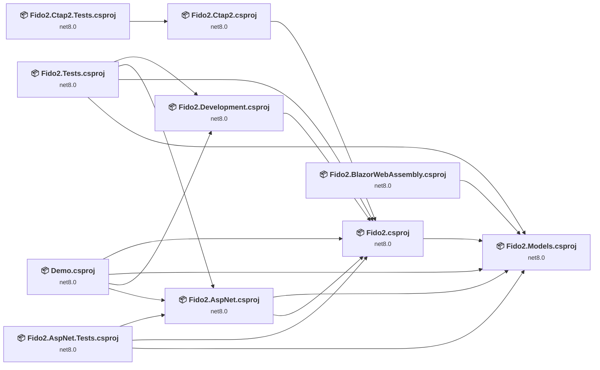

## Project Details

### Demo\Demo.csproj

#### Project Info

- **Current Target Framework:** net8.0
- **Proposed Target Framework:** net10.0
- **SDK-style**: True
- **Project Kind:** AspNetCore
- **Dependencies**: 4
- **Dependants**: 0
- **Number of Files**: 98
- **Number of Files with Incidents**: 2
- **Lines of Code**: 1550
- **Estimated LOC to modify**: 6+ (at least 0.4% of the project)

#### Dependency Graph

Legend:
📦 SDK-style project
⚙️ Classic project

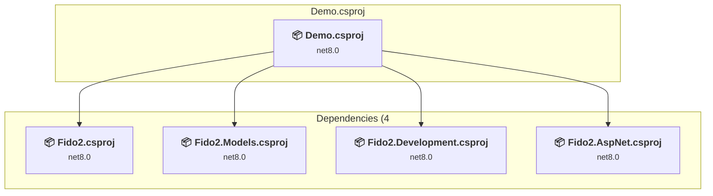

### API Compatibility

| Category | Count | Impact |
| :--- | :---: | :--- |
| 🔴 Binary Incompatible | 4 | High - Require code changes |
| 🟡 Source Incompatible | 1 | Medium - Needs re-compilation and potential conflicting API error fixing |
| 🔵 Behavioral change | 1 | Low - Behavioral changes that may require testing at runtime |
| ✅ Compatible | 2263 |  |
| ***Total APIs Analyzed*** | ***2269*** |  |

### Src\Fido2.AspNet\Fido2.AspNet.csproj

#### Project Info

- **Current Target Framework:** net8.0
- **Proposed Target Framework:** net10.0
- **SDK-style**: True
- **Project Kind:** ClassLibrary
- **Dependencies**: 2
- **Dependants**: 3
- **Number of Files**: 4
- **Number of Files with Incidents**: 2
- **Lines of Code**: 362
- **Estimated LOC to modify**: 5+ (at least 1.4% of the project)

#### Dependency Graph

Legend:
📦 SDK-style project
⚙️ Classic project

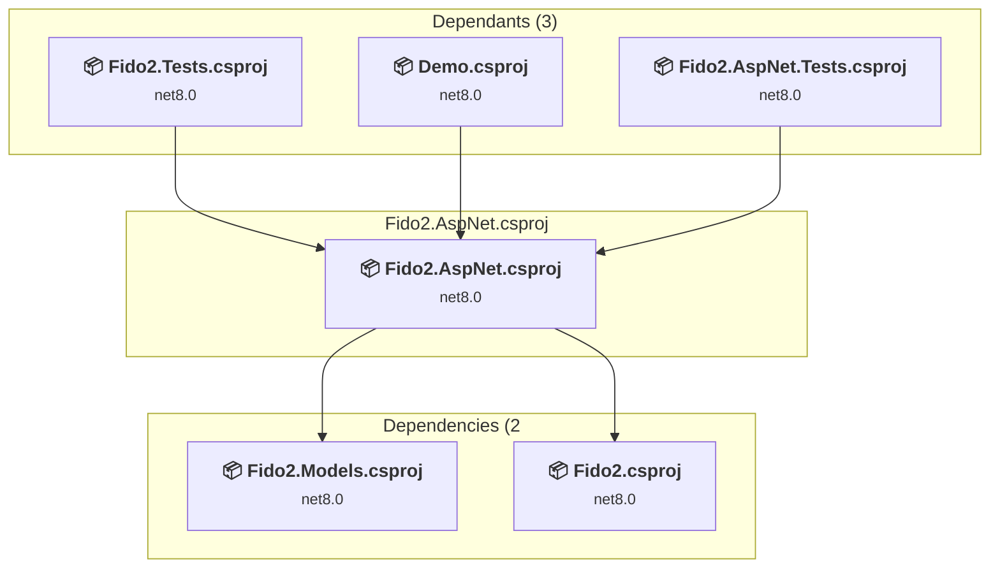

### API Compatibility

| Category | Count | Impact |
| :--- | :---: | :--- |
| 🔴 Binary Incompatible | 1 | High - Require code changes |
| 🟡 Source Incompatible | 0 | Medium - Needs re-compilation and potential conflicting API error fixing |
| 🔵 Behavioral change | 4 | Low - Behavioral changes that may require testing at runtime |
| ✅ Compatible | 316 |  |
| ***Total APIs Analyzed*** | ***321*** |  |

### Src\Fido2.BlazorWebAssembly\Fido2.BlazorWebAssembly.csproj

#### Project Info

- **Current Target Framework:** net8.0
- **Proposed Target Framework:** net10.0
- **SDK-style**: True
- **Project Kind:** ClassLibrary
- **Dependencies**: 1
- **Dependants**: 0
- **Number of Files**: 6
- **Number of Files with Incidents**: 1
- **Lines of Code**: 72
- **Estimated LOC to modify**: 0+ (at least 0.0% of the project)

#### Dependency Graph

Legend:
📦 SDK-style project
⚙️ Classic project

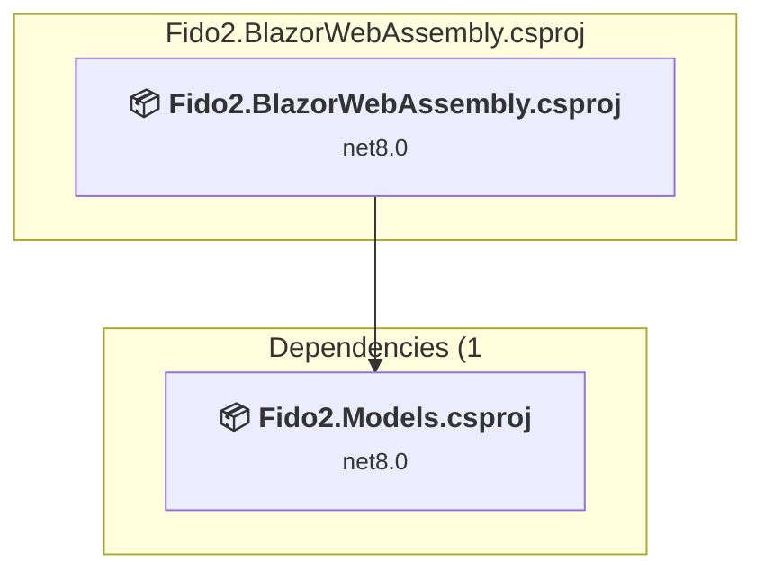

### API Compatibility

| Category | Count | Impact |
| :--- | :---: | :--- |
| 🔴 Binary Incompatible | 0 | High - Require code changes |
| 🟡 Source Incompatible | 0 | Medium - Needs re-compilation and potential conflicting API error fixing |
| 🔵 Behavioral change | 0 | Low - Behavioral changes that may require testing at runtime |
| ✅ Compatible | 4984 |  |
| ***Total APIs Analyzed*** | ***4984*** |  |

### Src\Fido2.Ctap2\Fido2.Ctap2.csproj

#### Project Info

- **Current Target Framework:** net8.0
- **Proposed Target Framework:** net10.0
- **SDK-style**: True
- **Project Kind:** ClassLibrary
- **Dependencies**: 1
- **Dependants**: 1
- **Number of Files**: 26
- **Number of Files with Incidents**: 1
- **Lines of Code**: 1382
- **Estimated LOC to modify**: 0+ (at least 0.0% of the project)

#### Dependency Graph

Legend:
📦 SDK-style project
⚙️ Classic project

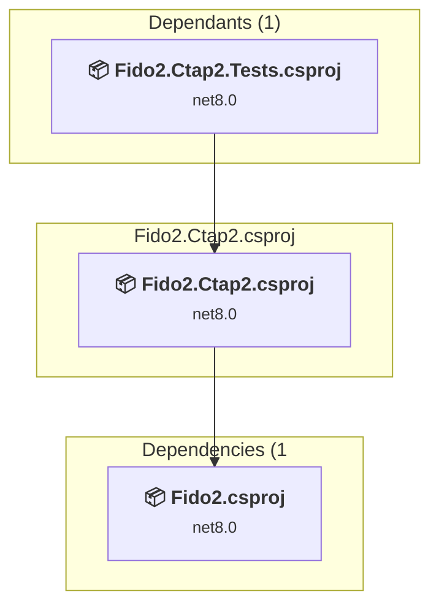

### API Compatibility

| Category | Count | Impact |
| :--- | :---: | :--- |
| 🔴 Binary Incompatible | 0 | High - Require code changes |
| 🟡 Source Incompatible | 0 | Medium - Needs re-compilation and potential conflicting API error fixing |
| 🔵 Behavioral change | 0 | Low - Behavioral changes that may require testing at runtime |
| ✅ Compatible | 522 |  |
| ***Total APIs Analyzed*** | ***522*** |  |

### Src\Fido2.Development\Fido2.Development.csproj

#### Project Info

- **Current Target Framework:** net8.0
- **Proposed Target Framework:** net10.0
- **SDK-style**: True
- **Project Kind:** ClassLibrary
- **Dependencies**: 1
- **Dependants**: 2
- **Number of Files**: 4
- **Number of Files with Incidents**: 1
- **Lines of Code**: 218
- **Estimated LOC to modify**: 0+ (at least 0.0% of the project)

#### Dependency Graph

Legend:
📦 SDK-style project
⚙️ Classic project

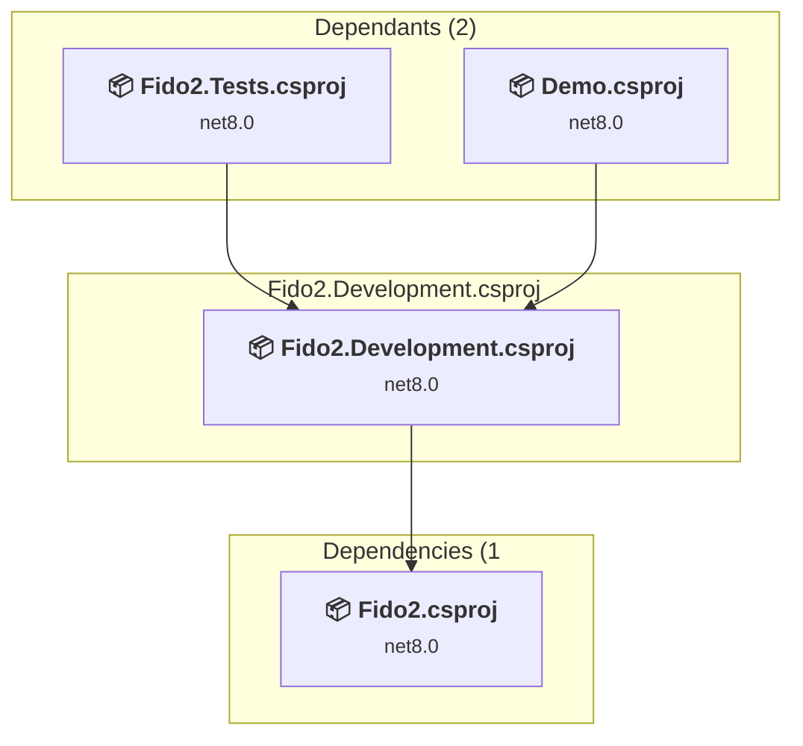

### API Compatibility

| Category | Count | Impact |
| :--- | :---: | :--- |
| 🔴 Binary Incompatible | 0 | High - Require code changes |
| 🟡 Source Incompatible | 0 | Medium - Needs re-compilation and potential conflicting API error fixing |
| 🔵 Behavioral change | 0 | Low - Behavioral changes that may require testing at runtime |
| ✅ Compatible | 243 |  |
| ***Total APIs Analyzed*** | ***243*** |  |

### Src\Fido2.Models\Fido2.Models.csproj

#### Project Info

- **Current Target Framework:** net8.0
- **Proposed Target Framework:** net10.0
- **SDK-style**: True
- **Project Kind:** ClassLibrary
- **Dependencies**: 0
- **Dependants**: 6
- **Number of Files**: 55
- **Number of Files with Incidents**: 2
- **Lines of Code**: 3237
- **Estimated LOC to modify**: 2+ (at least 0.1% of the project)

#### Dependency Graph

Legend:
📦 SDK-style project
⚙️ Classic project

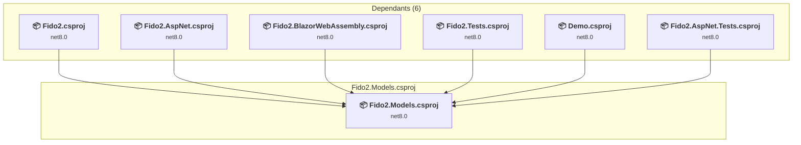

### API Compatibility

| Category | Count | Impact |
| :--- | :---: | :--- |
| 🔴 Binary Incompatible | 0 | High - Require code changes |
| 🟡 Source Incompatible | 0 | Medium - Needs re-compilation and potential conflicting API error fixing |
| 🔵 Behavioral change | 2 | Low - Behavioral changes that may require testing at runtime |
| ✅ Compatible | 11161 |  |
| ***Total APIs Analyzed*** | ***11163*** |  |

### Src\Fido2\Fido2.csproj

#### Project Info

- **Current Target Framework:** net8.0
- **Proposed Target Framework:** net10.0
- **SDK-style**: True
- **Project Kind:** ClassLibrary
- **Dependencies**: 1
- **Dependants**: 6
- **Number of Files**: 63
- **Number of Files with Incidents**: 15
- **Lines of Code**: 5464
- **Estimated LOC to modify**: 95+ (at least 1.7% of the project)

#### Dependency Graph

Legend:
📦 SDK-style project
⚙️ Classic project

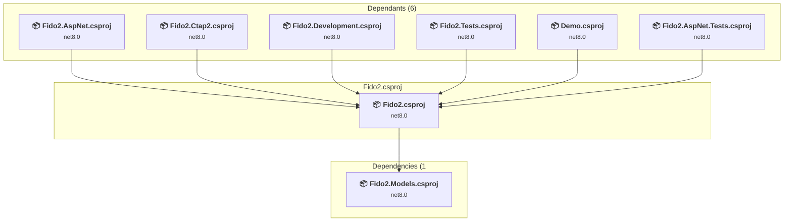

### API Compatibility

| Category | Count | Impact |
| :--- | :---: | :--- |
| 🔴 Binary Incompatible | 0 | High - Require code changes |
| 🟡 Source Incompatible | 87 | Medium - Needs re-compilation and potential conflicting API error fixing |
| 🔵 Behavioral change | 8 | Low - Behavioral changes that may require testing at runtime |
| ✅ Compatible | 4484 |  |
| ***Total APIs Analyzed*** | ***4579*** |  |

### Tests\Fido2.AspNet.Tests\Fido2.AspNet.Tests.csproj

#### Project Info

- **Current Target Framework:** net8.0
- **Proposed Target Framework:** net10.0
- **SDK-style**: True
- **Project Kind:** DotNetCoreApp
- **Dependencies**: 3
- **Dependants**: 0
- **Number of Files**: 3
- **Number of Files with Incidents**: 1
- **Lines of Code**: 98
- **Estimated LOC to modify**: 0+ (at least 0.0% of the project)

#### Dependency Graph

Legend:
📦 SDK-style project
⚙️ Classic project

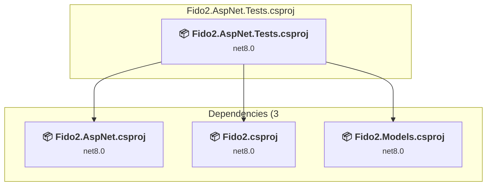

### API Compatibility

| Category | Count | Impact |
| :--- | :---: | :--- |
| 🔴 Binary Incompatible | 0 | High - Require code changes |
| 🟡 Source Incompatible | 0 | Medium - Needs re-compilation and potential conflicting API error fixing |
| 🔵 Behavioral change | 0 | Low - Behavioral changes that may require testing at runtime |
| ✅ Compatible | 101 |  |
| ***Total APIs Analyzed*** | ***101*** |  |

### Tests\Fido2.Ctap2.Tests\Fido2.Ctap2.Tests.csproj

#### Project Info

- **Current Target Framework:** net8.0
- **Proposed Target Framework:** net10.0
- **SDK-style**: True
- **Project Kind:** DotNetCoreApp
- **Dependencies**: 1
- **Dependants**: 0
- **Number of Files**: 7
- **Number of Files with Incidents**: 1
- **Lines of Code**: 371
- **Estimated LOC to modify**: 0+ (at least 0.0% of the project)

#### Dependency Graph

Legend:
📦 SDK-style project
⚙️ Classic project

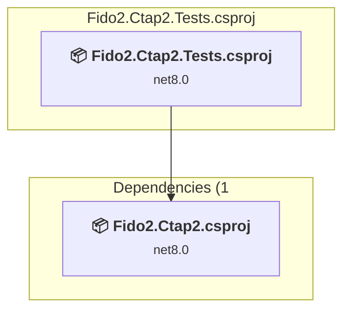

### API Compatibility

| Category | Count | Impact |
| :--- | :---: | :--- |
| 🔴 Binary Incompatible | 0 | High - Require code changes |
| 🟡 Source Incompatible | 0 | Medium - Needs re-compilation and potential conflicting API error fixing |
| 🔵 Behavioral change | 0 | Low - Behavioral changes that may require testing at runtime |
| ✅ Compatible | 180 |  |
| ***Total APIs Analyzed*** | ***180*** |  |

### Tests\Fido2.Tests\Fido2.Tests.csproj

#### Project Info

- **Current Target Framework:** net8.0
- **Proposed Target Framework:** net10.0
- **SDK-style**: True
- **Project Kind:** DotNetCoreApp
- **Dependencies**: 4
- **Dependants**: 0
- **Number of Files**: 69
- **Number of Files with Incidents**: 8
- **Lines of Code**: 13648
- **Estimated LOC to modify**: 50+ (at least 0.4% of the project)

#### Dependency Graph

Legend:
📦 SDK-style project
⚙️ Classic project

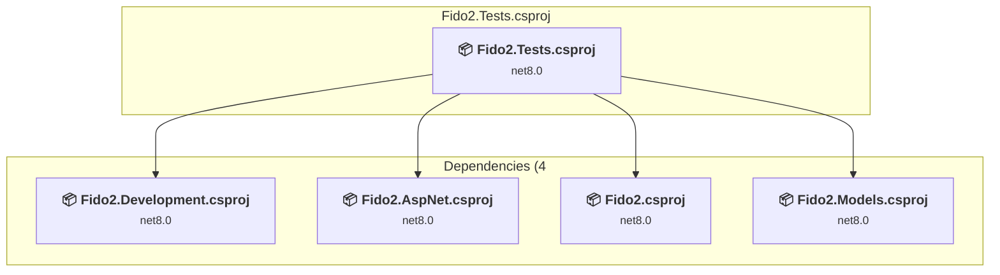

### API Compatibility

| Category | Count | Impact |
| :--- | :---: | :--- |
| 🔴 Binary Incompatible | 0 | High - Require code changes |
| 🟡 Source Incompatible | 15 | Medium - Needs re-compilation and potential conflicting API error fixing |
| 🔵 Behavioral change | 35 | Low - Behavioral changes that may require testing at runtime |
| ✅ Compatible | 15269 |  |
| ***Total APIs Analyzed*** | ***15319*** |  |

